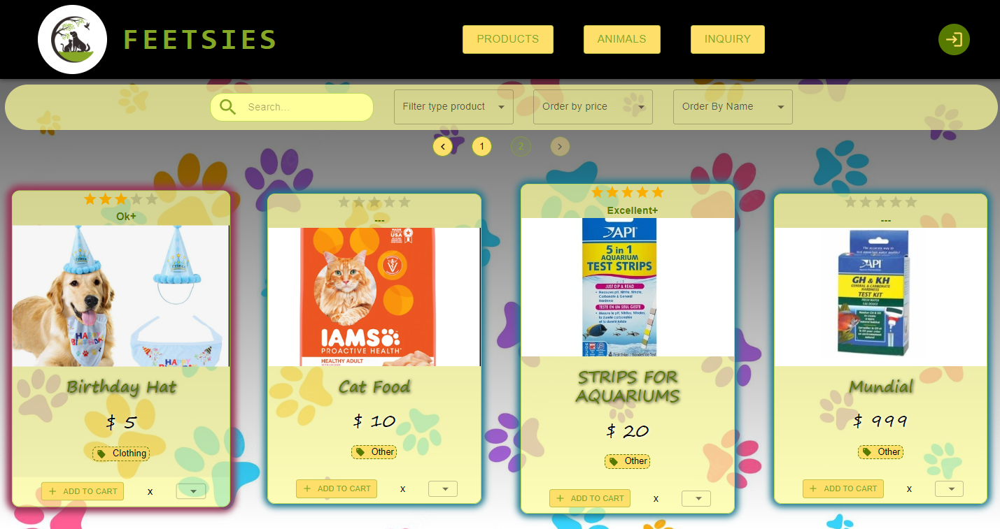
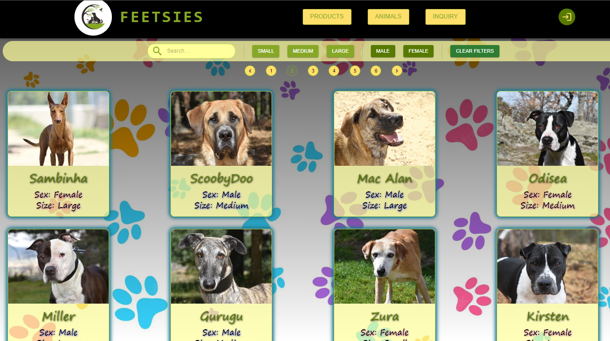
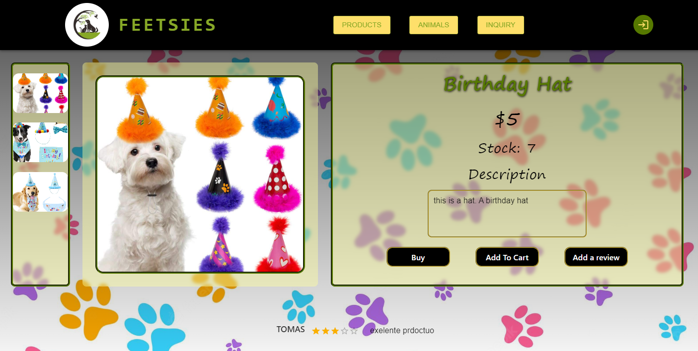
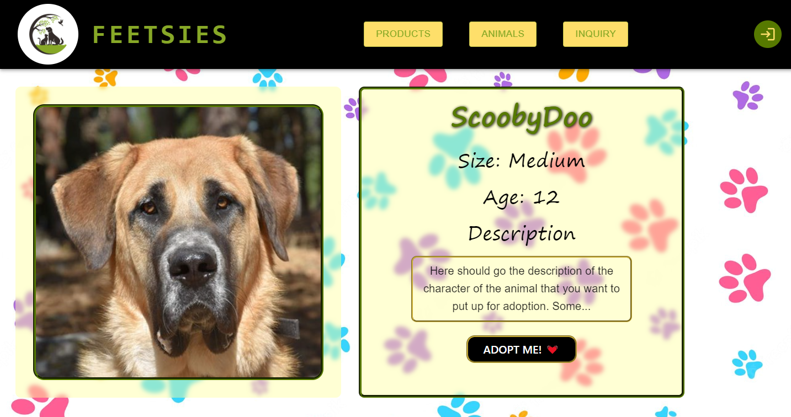
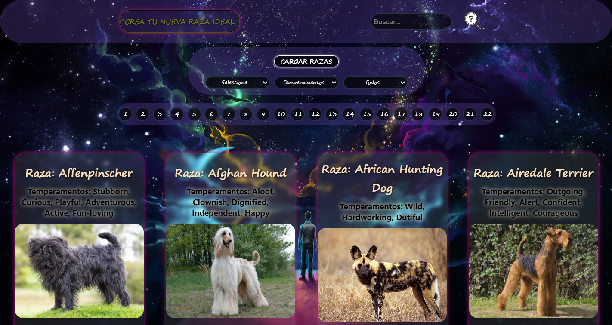
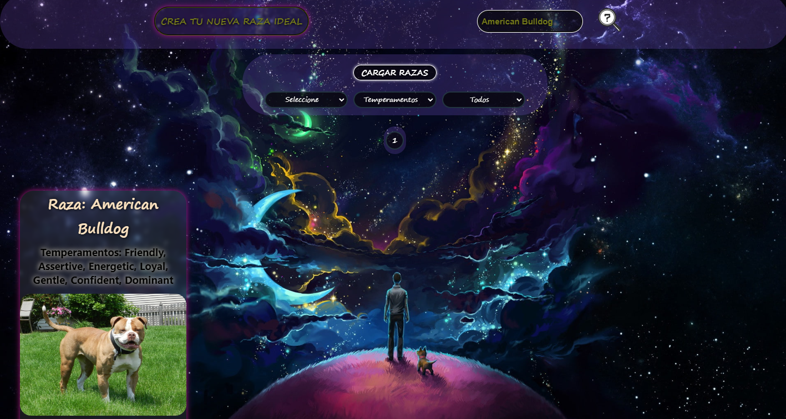
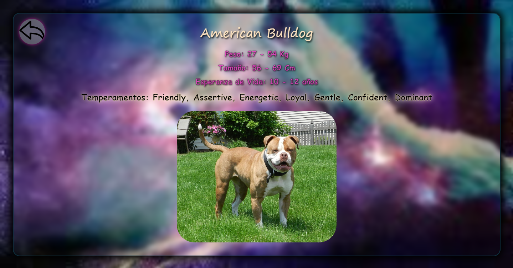
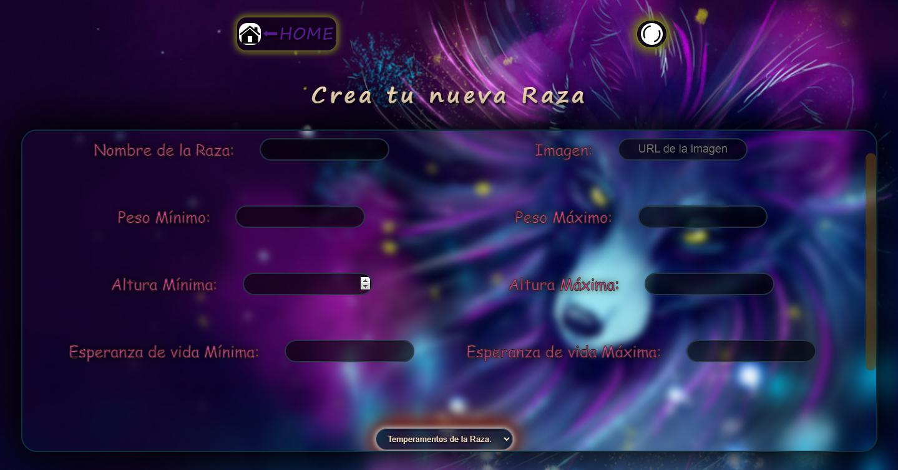

<h2 align="center">
    FullStack Developer from Argentina 
    
</h2>

&nbsp;&nbsp;

 
 
## 💻 Languages and Tools:

 
    
    
    
    
     
     
     
     
     
     
    
     
    

&nbsp;

## :pushpin: My proyects

### Página perteneciente a un refugio de animales domésticos, que a su vez posee elementos de E-Commerce. 
#### App que permite hacer compras de productos, dejar reviews, ver los reviews de los demas compradores, sistema de login y autenticación por google. Ademas de posibilidad de adoptar o dejar en adopcion algun animal. Cuenta tambien con Panel Admin y funciones correspondientes.
#### Usando React, Redux, Material UI en el Frontend  y Node, Express, Sequelize en el Backend
 

    

        
        
        
        
    
 

    <h2 align="center">
        Press to go to deploy ------>
        
    </h2>

&nbsp; 

### Desarrollé una App de Perros que incluía: búsquedas, filtrados, ordenamientos y creación.
#### Usando React, Redux, CSS puro para el Frontend y desarrollado en Node.js con Express para el Backend. Base de datos en PostgreSQL y Sequelize.
 

    

        
        
        
        
    

&nbsp;

## :paperclip: How to reach me:

<a href="https://www.linkedin.com/in/tomas-garnero/" target="_blank" > &nbsp;
<a href="mailto:tomygarnero9429@gmail.com" >
</a>

&nbsp;
    
## 📊 GitHub Stats:
 

    

    &nbsp;
    

    

