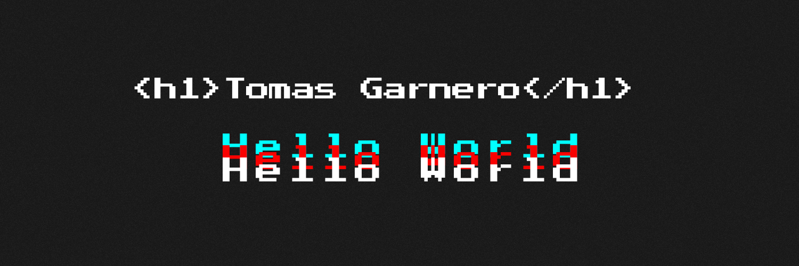

<h2 align="center">
    FullStack Developer from Argentina 
    
</h2>

&nbsp;&nbsp;

 

<h3 align="left">💻 Languages and Tools:</h3>
    
 
         
         
         
         
         
        
         
         
         
         
         
         
         
         
        
    

